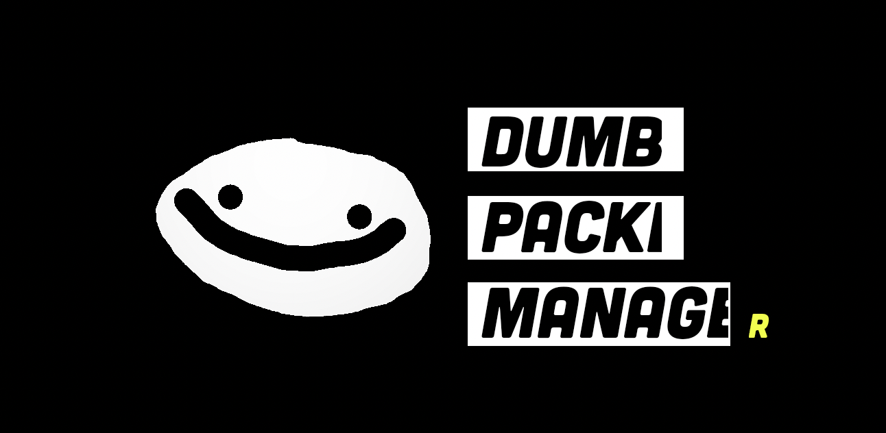

# DPM - Dumb Packet Manager



DPM is a profile-driven command-line tool manager for reproducible workstation setup.

It is built for fast, repeatable onboarding in course labs, security workflows, and team environments where consistent tool versions matter.

> [!IMPORTANT]
> DPM is not a replacement for full ecosystem package managers.
> It focuses on curated, repeatable setup with a controlled catalog.

## Why DPM

Most setup failures happen before real work starts.

DPM reduces that friction by combining tool install, profile application, search, integrity checks, and health checks into one CLI workflow.

## Quick Start

Install on Linux or macOS:

```bash
curl -sL https://dpm.fi/install.sh | sh
dpm version
```

> [!TIP]
> Start with dpm search, then use result numbers directly in install or apply commands.

## What You Can Do

- Install tools with default, exact, or major-version selection.
- Apply curated profiles to set up multiple tools in one run.
- Search tools, local profiles, and community profile index entries.
- Inspect community profiles and dotfiles before applying changes.
- Verify files with SHA-256 checks.
- Run system health checks with doctor.
- Reset DPM-managed state with restore.
- Use bubble sessions for temporary, disposable environments.

## Installation Requirements

### Base Requirements

- Linux or macOS environment.
- curl or wget for the install script.
- Standard Unix shell tools.

### Supported Package Managers And Install Methods

DPM resolves install methods from catalog entries.

| Method | Runtime requirement | Typical dependency |
| --- | --- | --- |
| HTTP | Outbound network access | curl or equivalent network stack |
| apt | apt-get available and sudo privileges | apt (Debian/Ubuntu family) |
| Homebrew | brew available in PATH | Homebrew |
| pip | pip3 or pip available in PATH | Python + pip |
| cargo | cargo available in PATH | Rust toolchain |

### Feature-Specific Requirements

- Dotfile install workflows require git in PATH.
- Bubble mode requires temporary directory support under /tmp.

## DPM Command Reference

> [!TIP]
> Every command has explicit dashed aliases, for example -i and --install.
> Short command aliases are lowercase only.
> Command options also keep short and long forms, for example -v and --verbose.

| Command alias | Options (short and long) | Purpose | Example |
| --- | --- | --- | --- |
| -i, --install | -v, --verbose | Install a tool or matching course/profile target | dpm -i -v binwalk@2 |
| -r, --remove | none | Remove an installed tool | dpm --remove binwalk |
| -u, --update | -a, --all | Check or update installed tools to latest catalog version | dpm -u -a |
| -l, --list | -a, --all and -c, --category | List installed tools or catalog tools | dpm --list -a |
| -s, --search | -a, --all and -t, --tools and -p, --profiles and -c, --community | Search tools, profiles, and community index entries | dpm -s -t nmap |
| -x, --inspect | none | Inspect a community profile before applying | dpm --inspect 4 |
| -k, --verify | none | Verify a file SHA-256 hash | dpm -k ./file.tar.gz <sha256> |
| -v, --version | none | Print DPM version | dpm -v |
| -a, --apply | none | Apply a local profile | dpm --apply ICI012AS3A |
| -c, --config + -i, --install | -i, --id and -m, --map | Install and map dotfiles from repo or local path | dpm -c -i user/dotfiles |
| -c, --config + --scan | --apply and --scripts | Scan a dotfiles repo and optionally apply detected configs | dpm -c --scan --apply user/dotfiles |
| -c, --config + -x, --inspect | none | Inspect community profile and optional dotfile | dpm -c -x 4 .tmux.conf |
| --settings | list, set, toggle, reset | View and edit persisted DPM settings | dpm --settings set offline-mode true |
| -o, --restore | -y, --yes | Reset DPM-managed tools and state | dpm -o -y |
| -b, --bubble | none | Start an ephemeral bubble session | dpm -b |
| -d, --doctor | none | Run health and configuration checks | dpm --doctor |
| -n, --serve | -s, --stdio | Start JSON-RPC backend for TUI integration | dpm -n -s |

## Dotfiles

`dpm config install <repo>` clones a dotfiles repo and applies file mappings.

Supported repo URL forms:

- GitHub shorthand: `user/repo`
- HTTPS: `https://github.com/user/repo`
- SSH protocol: `ssh://user@host/path/repo.git`
- SCP-style SSH: `user@host:/path/repo.git`

### Manifest

A repo can declare its mappings in a top-level `dpm.yaml` so callers do not
need `--map` flags. When the manifest is present, DPM reads it after cloning.

```yaml
id: my-dotfiles
name: my-dotfiles
description: Personal configs shared across machines
mappings:
  - source: ohmyposh/theme.toml
    target: .config/ohmyposh/theme.toml
    merge_strategy: backup
  - source: tmux/tmux.conf
    target: .tmux.conf
    merge_strategy: backup
```

Targets are resolved relative to `$HOME`. Merge strategies are `backup` (default),
`append`, `skip`, or `force`. CLI `--map` flags override the manifest when both
are supplied.

## Who It Is For

- IT students who need fast course setup.
- Instructors who need consistent environments across a class.
- Security and developer teams that value reproducibility over breadth.

## Limitations And Known Issues

- Native support is Linux and macOS. Windows users should use WSL where possible.
- Community profiles can be searched and inspected, but direct remote community profile install is still limited.
- Some install paths depend on system package managers and may require elevated privileges.
- The catalog is curated and does not aim to match full package ecosystem coverage.

## Development

### Local Build Dependencies

- For make dpm: Go 1.25+, make, and a Unix-like shell toolchain.
- For make dpm_check: gcc or another C compiler.
- For make tui: Rust and Cargo.

If you only build the main CLI binary, Go and make are the key requirements.

Build CLI from source:

```bash
make dpm
./dpm version
```

Build optional TUI frontend:

```bash
make tui
```

## License

This project is licensed under the MIT License.

See LICENSE for the full license text.
